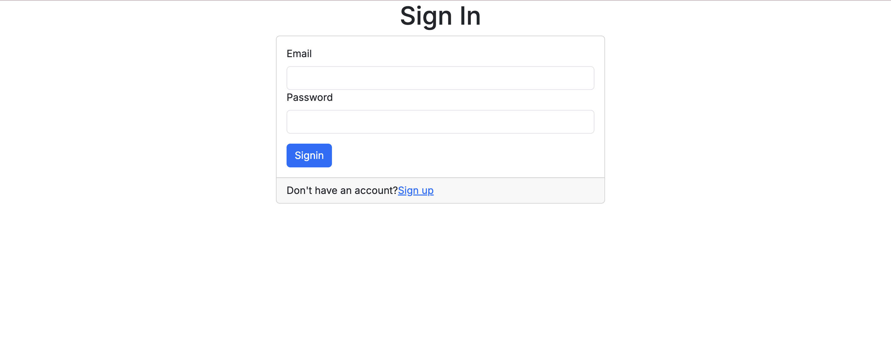
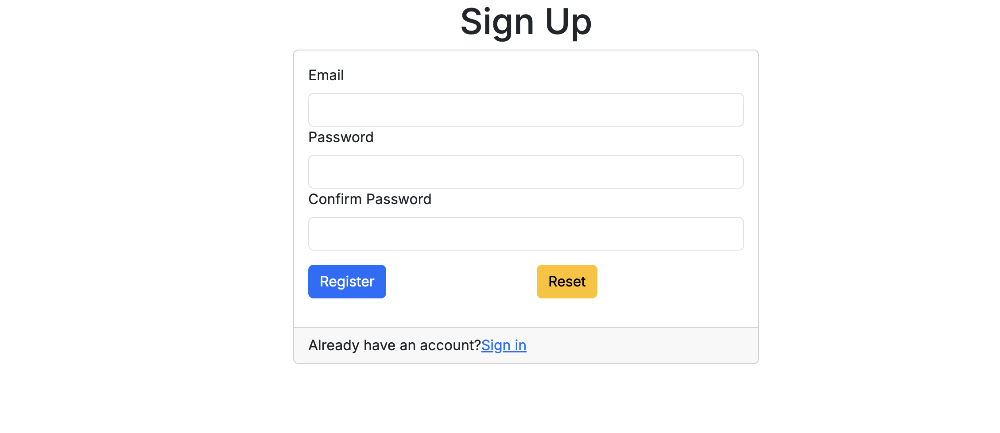
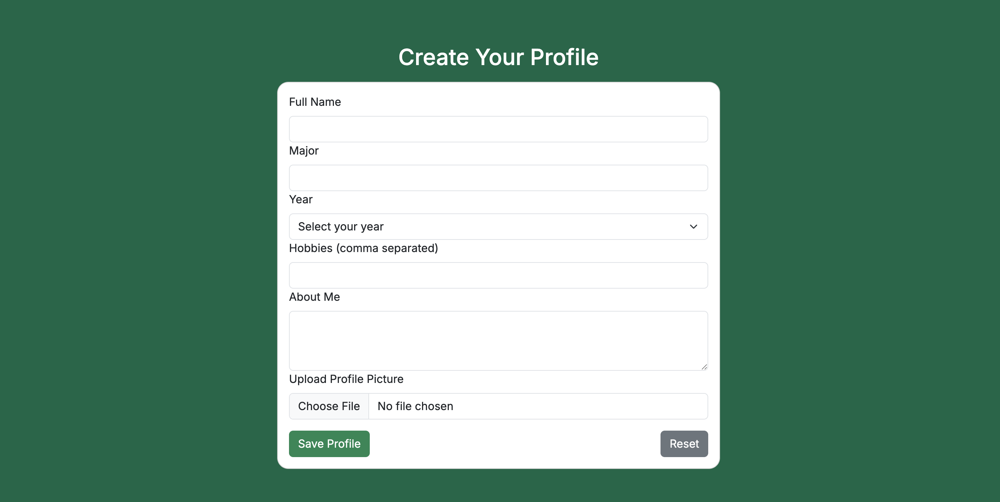
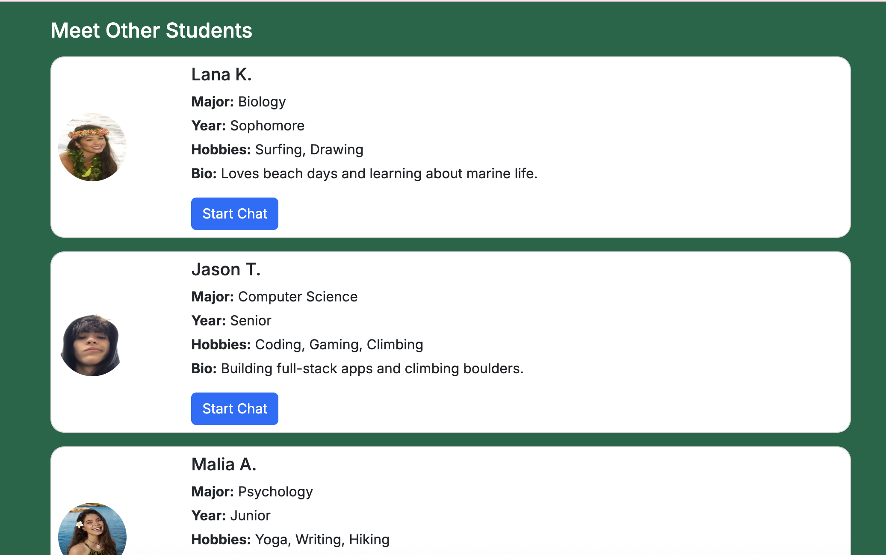
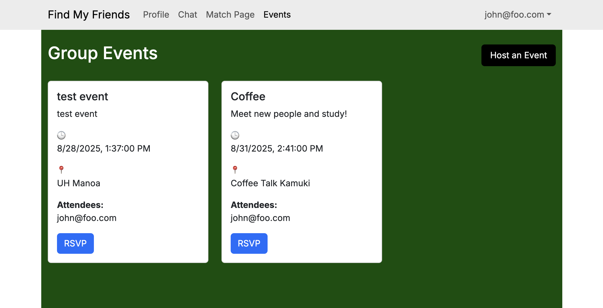
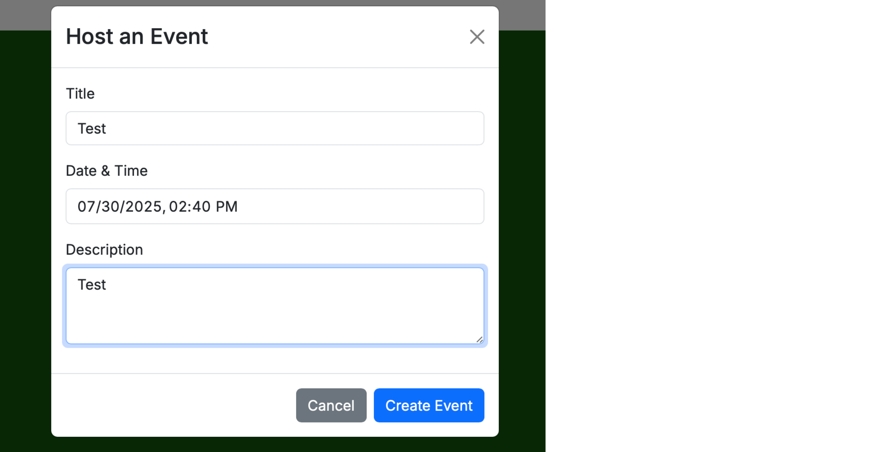
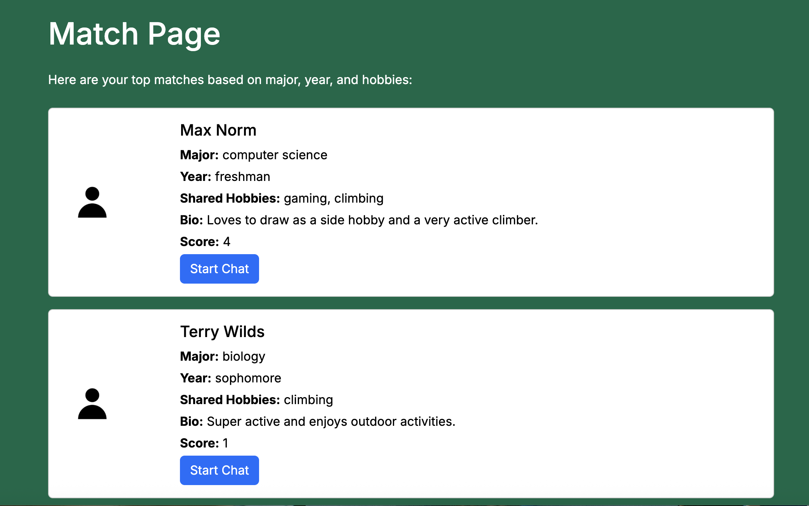
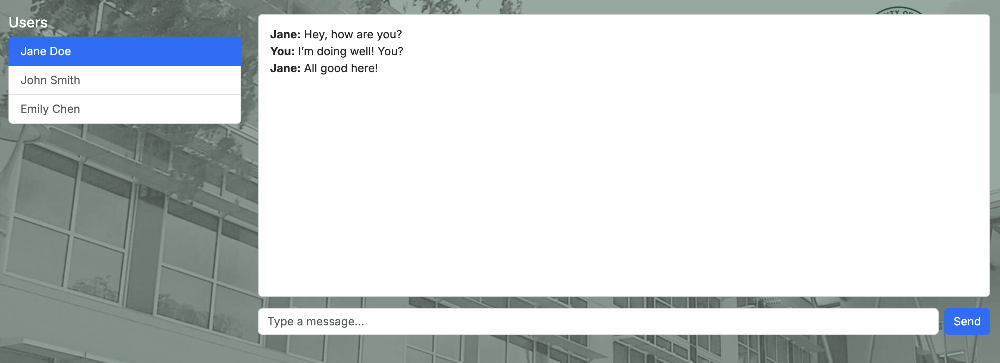

# Welcome To *Find My Friends*

## 💡 Project Overview  
*Making Friends at UH* is a web-based platform designed to help University of Hawaiʻi students build real friendships based on shared interests, majors, and campus life. College can sometimes feel isolating, especially for new or transfer students—our goal is to create a safe, inclusive space where students can connect with others who share similar goals, hobbies, or academic paths.

This project is being developed as part of our computer science coursework to explore full-stack web development, user-centered design, and meaningful community-building through technology.

---

## 🎯 Project Goals  
- **Help students make genuine connections** at UH through interest-based matching  
- **Support community involvement** by linking users with shared clubs, classes, or events  
- **Provide a clean, intuitive user experience** that feels both modern and welcoming  
- **Ensure user safety and privacy** through email authentication and moderation tools  

---

## 🌐 What the Final System Will Provide  
By the end of the project, the system will include:
- ✅ Student profile creation with custom interests, major, and personality tags  
- ✅ A smart matching algorithm to suggest compatible potential friends  
- ✅ A “mutual interest” system to encourage respectful connections  
- ✅ A secure, UH-verified messaging system  
- ✅ Optional event suggestions to find peers attending the same UH events  

---

## Links for Find My Friends
Organization [Organization](https://github.com/find-my-friends)
Project Homepage Repo [Homepage](https://github.com/find-my-friends/find-my-friends.github.io)
App Repo [App](https://github.com/find-my-friends/find-my-friends-app)

---

## Team Contract
Team Contract [Contract](https://docs.google.com/document/d/1Eysd0Iy83z_mRXBqKkvVC6nXLPw_i9AGmqLGSKx-TfA/edit?usp=sharing)

---

## Deployment

You can access the deployed version of the **Find My Friends** app here:

[https://find-my-friends.vercel.app](https://find-my-friends-app.vercel.app/)

---

## User Guide
### Landing Page
The landing page provides a clean, color-blocked layout that introduces the purpose of the “Find My Friends” app. It features UH Mānoa branding, a login and sign-up area, and a visual overview of how students can connect based on shared majors and interests.

### Sign In Page
The sign in page provides a clear way for users to login to use the site.

### Sign Up Page
The sign up page provides new users a way to create their account and become a new user of the site.

### Logged In Landing Page
When users log in they're greeted with a welcome message as well as a navigation bar full of options for them to explore.

### Profile Page
The profile page allows users to create their own profile as well as upload a profile picture. They can also view other users of the site and connect with them as well via the "start chat" button.

### Group Events Page
The group events page allows users to see informaton about events hosted by others, or create and host their own event. "Host an event" button leads to a forum where users can choose a title, date, and description for their event. 

### Match Page
The match page displays potential friends based on location, interests, and more. The list shown is determined based off a "score" system that is higher depending on how much your profile has in common with other profiles.

### Chat Feature
The chat page allows you to chat with other users on the site to make plans or just get to know each other.

---
## Community Feedback

To evaluate the usability and overall experience of *Find My Friends*, five community members from diverse backgrounds tested the application. Feedback was gathered through informal interviews and observation of how each user interacted with the platform.

### Overall Impressions
Participants appreciated the concept of connecting UH Mānoa students based on shared interests, majors, and classes. Many highlighted that the clean, simple interface made the app approachable for first-time users. The green UH-themed color scheme and minimalistic layout were described as “inviting” and “easy on the eyes.”

### Positive Feedback
- **Profile Creation:** Users found the profile form straightforward, with clear fields for name, major, hobbies, and bio. The one-profile-per-account limit was seen as a good feature to keep data organized.
- **Photo Uploads:** The ability to add a profile picture made profiles feel more personal and engaging.
- **Browsing Profiles:** Participants liked that they could see both default example profiles and real user profiles, giving them a feel for how the community might grow.
- **Start Chat Button:** Users found it intuitive and appreciated how it directly linked them to the chat page without extra steps.

### Areas for Improvement
- **Search & Filters:** Several participants suggested adding filters (e.g., by major, year, or hobbies) to make finding similar people faster.
- **Profile Editing:** While the “Edit Profile” button worked, a couple of users felt it could be more prominent.
- **Chat Features:** Some users expressed interest in enhancing the chat system with read receipts or group chat options.
- **Mobile Optimization:** While functional on mobile, a few users noted that profile cards could be resized or stacked differently for better small-screen readability.

### Conclusion
Overall, the feedback was positive, with testers stating they could see themselves using the platform to meet new people on campus. The main suggestions focused on expanding search features, improving chat functionality, and fine-tuning the mobile experience. These insights will guide future iterations of *Find My Friends* to make it even more useful and engaging for the UH community.

---

## Developer Guide

This guide walks a new developer through downloading, installing, running, and modifying **Find My Friends**.

### 1. Prerequisites
- Node.js 18+ and npm 9+
- Git
- PostgreSQL database (Neon, Vercel Postgres, or local)
- (Optional) Vercel CLI: npm i -g vercel

### 2. Download & Install
1. Clone the repository:
   git clone https://github.com/<your-org>/<your-repo>.git
   cd <your-repo>
2. Install dependencies:
   npm install

### 3. Environment Variables
Create a `.env` file in the project root with:
DATABASE_URL="postgres://<user>:<password>@<host>/<db>?sslmode=require"
NEXTAUTH_URL="http://localhost:3000"
NEXTAUTH_SECRET="<openssl rand -base64 32>"
Add OAuth provider keys if needed (Google, GitHub, etc.).

### 4. Database Setup
Run:
npx prisma migrate dev --name init
(Optional) seed the database:
npx prisma db seed

### 5. Run Locally
Run:
npm run dev
Then visit http://localhost:3000

### 6. Deployment (Vercel)
Run:
vercel login
vercel link
vercel
Set environment variables in the Vercel dashboard under Project Settings → Environment Variables, then redeploy.

### 7. Modifying the App
- Add new fields: Update prisma/schema.prisma, run npx prisma migrate dev, and update forms/API.
- Change image handling: Switch between base64 storage or hosted image URLs.
- Add search/filters: Update API routes to accept query params and add UI controls.

### 8. Troubleshooting
- P1001 (Prisma cannot connect): Check DATABASE_URL, SSL mode, and database access.
- Auth issues: Ensure NEXTAUTH_URL and NEXTAUTH_SECRET match in `.env` and Vercel.
- Images not showing: If storing base64, include the prefix data:image/...;base64,.

---

## Project Pages
### M1
M1 Project Page [M1](https://github.com/orgs/find-my-friends/projects/1)

### M2
M2 Project Page [M2](https://github.com/orgs/find-my-friends/projects/2)

### M3
M3 Project Page [M3](https://github.com/orgs/find-my-friends/projects/3)
